JJUG CCC Fall 2014 [R5-3] Spring Bootハンズオン～Spring Bootで作るマイクロサービスアーキテクチャ！手順書 #jjug_ccc #ccc_r53

.. contents:: 目次
  :depth: 2


事前準備
================================================================================

必要なソフトウェアのインストール
--------------------------------------------------------------------------------

Mac/Windowsユーザー向けに記述しています。Linuxで実施する場合は同等の手順を実施してください。

Java SE 8
^^^^^^^^^^^^^^^^^^^^^^^^^^^^^^^^^^^^^^^^^^^^^^^^^^^^^^^^^^^^^^^^^^^^^^^^^^^^^^^^
http://www.oracle.com/technetwork/java/javase/downloads/jdk8-downloads-2133151.html\ からJava SE Development Kit 8u25 (8以上であればおそらくOK)をダウンロードして、
インストールしてください。

環境変数\ ``JAVA_HOME``\ の設定と\ ``PATH``\ の追加を必ず行ってください。

Maven
^^^^^^^^^^^^^^^^^^^^^^^^^^^^^^^^^^^^^^^^^^^^^^^^^^^^^^^^^^^^^^^^^^^^^^^^^^^^^^^^
http://ftp.meisei-u.ac.jp/mirror/apache/dist/maven/maven-3/3.2.3/binaries/apache-maven-3.2.3-bin.tar.gz\ からMavenをダウンロードして、
展開したディレクトリのbinフォルダを環境変数\ ``PATH``\ に追加してください。

尚、(ハンズオン資材のルートフォルダ)/software/apache-maven-3.2.3-bin.tar.gzにダウンロード済みです。

Git Bash (Windowsの場合)
^^^^^^^^^^^^^^^^^^^^^^^^^^^^^^^^^^^^^^^^^^^^^^^^^^^^^^^^^^^^^^^^^^^^^^^^^^^^^^^^
Windowsの場合、

http://git-scm.com/download/win\ からGitをダウンロードしてインストールしてください。

以下で実行するコマンドは全て\ **Gitに付属しているGit Bashを用いて実行してください**\ 。

jq (オプション)
^^^^^^^^^^^^^^^^^^^^^^^^^^^^^^^^^^^^^^^^^^^^^^^^^^^^^^^^^^^^^^^^^^^^^^^^^^^^^^^^
必須ではないですが、JSON出力の整形用に\ http://stedolan.github.io/jq/\ をインストールしておくと良いです。

Redis
^^^^^^^^^^^^^^^^^^^^^^^^^^^^^^^^^^^^^^^^^^^^^^^^^^^^^^^^^^^^^^^^^^^^^^^^^^^^^^^^

Macの場合は、以下を実行してください。(要:XCode)

.. code-block:: bash

    $ cd (ハンズオン資材のルートフォルダ)/software/redis-2.8.17
    $ tar xzvf redis-2.8.17.tar.gz
    $ cd redis-2.8.17
    $ make

Windows 64ビットの場合は、(ハンズオン資材のルートフォルダ)/software/redis-2.8.17/redis-2.8.17.zipを展開してください。

Windows 32ビットの場合は、(ハンズオン資材のルートフォルダ)/software/redis-2.8.17/edisbin.zipを展開してください。


Gitbucket
^^^^^^^^^^^^^^^^^^^^^^^^^^^^^^^^^^^^^^^^^^^^^^^^^^^^^^^^^^^^^^^^^^^^^^^^^^^^^^^^
https://github.com/takezoe/gitbucket/releases/download/2.5/gitbucket.war\ より、Gitbucketをダウンロードしてください。

尚、(ハンズオン資材のルートフォルダ)/software/gitbucket.warにダウンロード済みです。

IntelliJ IDEA
^^^^^^^^^^^^^^^^^^^^^^^^^^^^^^^^^^^^^^^^^^^^^^^^^^^^^^^^^^^^^^^^^^^^^^^^^^^^^^^^

https://www.jetbrains.com/idea/download/\ より、IntelliJ IDEA 14のCommunity EditionまたはUltimate Editionをダウンロードしてインストールしてください。

Spring Tool SuiteやEclipseを使用してもハンズオンを実施できますが、ハンズオンの説明はIntelliJ IDEAを用いて行います。


Mavenリポジトリのコピー
--------------------------------------------------------------------------------
ハンズオンはオフライン環境で行います。

必要なライブラリをインターネットからダウンロードせず直接Mavenリポジトリにコピーします。

(ハンズオン資材のルートフォルダ)/repository以下を(ホームディレクトリ)/.m2/repository以下にコピーしてください。

.. code-block:: bash

    $ cp -rf (ハンズオン資材のルートフォルダ)/repository/* ~/.m2/repository/

\ ``overwrite /Users/maki/.m2/repository/antlr/antlr/2.7.2/_maven.repositories? (y/n [n])``\ というように上書きするかどうか聞かれる場合は


.. code-block:: bash

    $ \cp -rf (ハンズオン資材のルートフォルダ)/repository/* ~/.m2/repository/

を実行してください。

演習の全体像
================================================================================

本演習で「URL短縮サービス」を題材にマイクロサービスアーキテクチャを構築します。

最終的に構築するアーキテクチャを以下に示します。

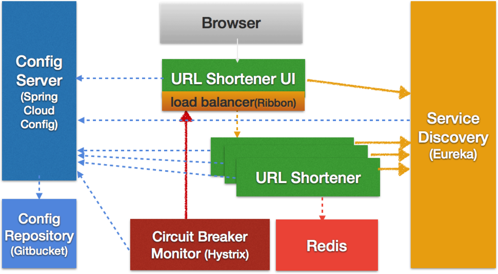

演習1ではSpring Bootを用いて単一の「URL短縮サービス」を作成します。

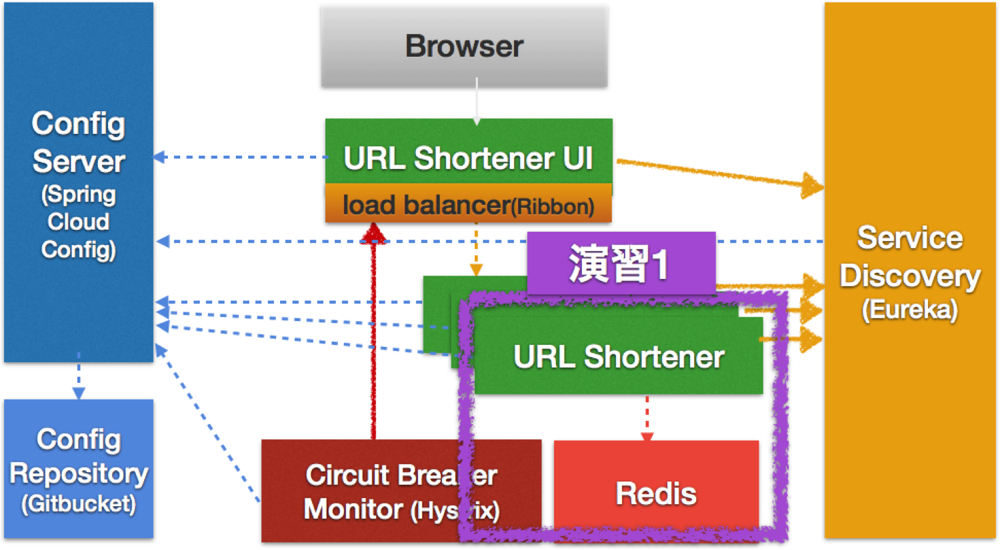

演習2ではSpring Cloud Configを用いて「URL短縮サービス」に動的コンフィギュレーションを追加します。

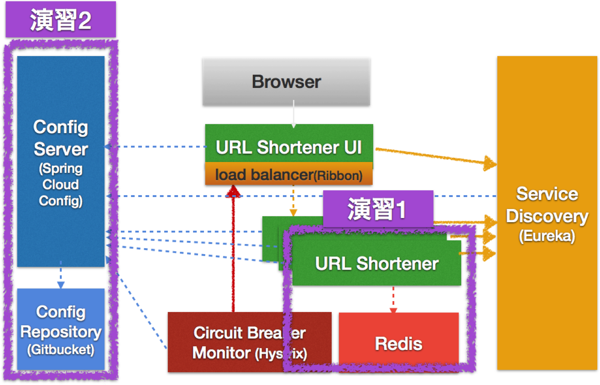

演習3では「URL短縮サービス」のUIを追加し、Spring Cloud Netflixを用いて「URL短縮サービス」にマイクロサービスアーキテクチャのための様々なパターンを追加します。

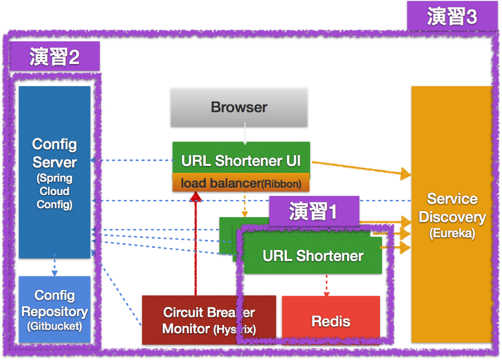


本来は複数のマシンを用いて構築しますが、本演習では1つのマシン上で全てのサービスを起動します。

演習1 Spring Bootで「URL短縮サービス」を作る
================================================================================

演習1ではマイクロサービス界でのFizzBuzz問題である、「URL短縮サービス」を作ります。

課題1で\ ``ConcurrentHashMap``\ を使った実装。課題2でRedisを使った実装を行います。

インポートするプロジェクトにほとんどのコードが実装されているので、課題で実装するコードはほんの数行です。

演習プロジェクトの作成・インポート
--------------------------------------------------------------------------------

新規プロジェクト作成
^^^^^^^^^^^^^^^^^^^^^^^^^^^^^^^^^^^^^^^^^^^^^^^^^^^^^^^^^^^^^^^^^^^^^^^^^^^^^^^^

IntelliJ IDEAを開いて「New Project」で新規プロジェクトを作成します。
以下のように「Empty Project」を選択してください。

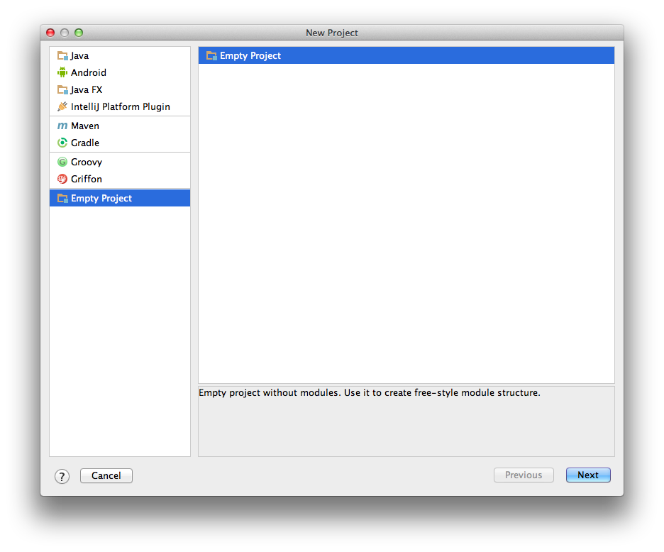

以下の設定値を入力してください。\ **デフォルト値から変更するので注意してください** \ 。

.. tabularcolumns:: |p{0.30\linewidth}|p{0.70\linewidth}|
.. list-table::
   :stub-columns: 1
   :widths: 30 70

   * - | Project name
     - | jjugccc-handson
   * - | Project location
     - | (ハンズオン資材のルートフォルダ)/exercise


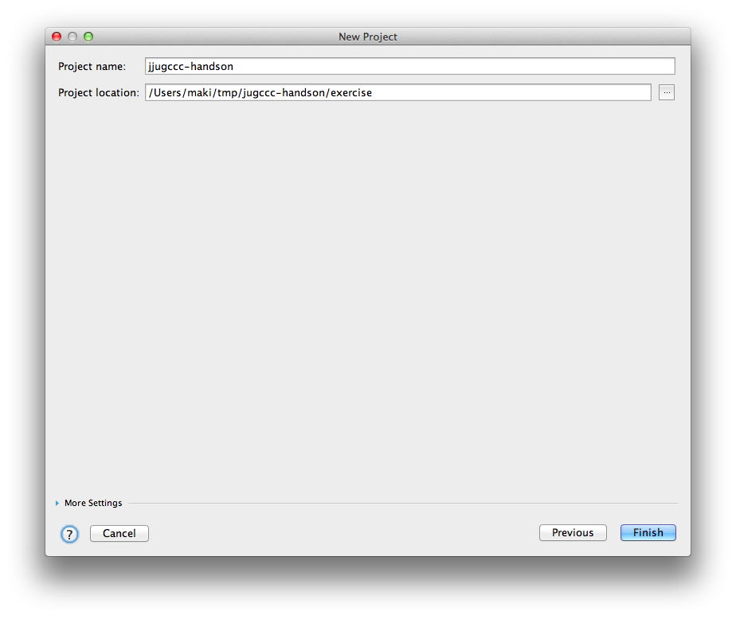

「Project Structure」で以下の設定値を入力してください。

.. tabularcolumns:: |p{0.30\linewidth}|p{0.70\linewidth}|
.. list-table::
   :stub-columns: 1
   :widths: 30 70

   * - | Project SDK
     - | 1.8
   * - | Project language level
     - | 8


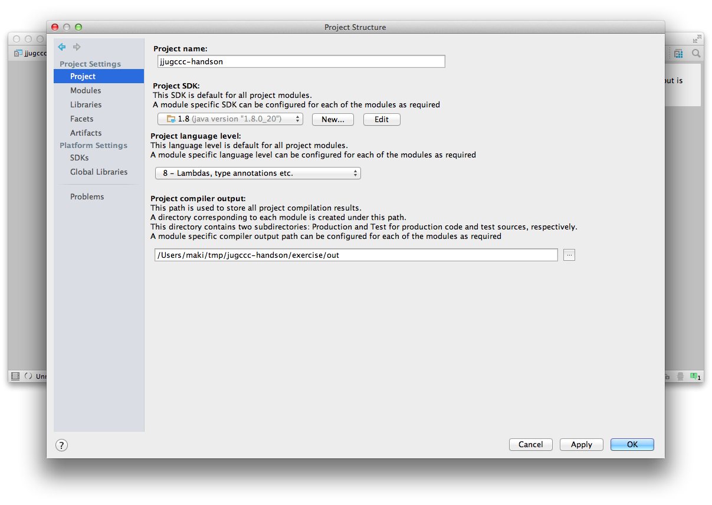


JDKが未設定の場合は、「New」を押してJDKを設定してください。JAVA_HOMEに相当するフォルダを選択すれば良いです。


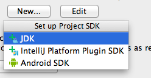

演習プロジェクトのインポート
^^^^^^^^^^^^^^^^^^^^^^^^^^^^^^^^^^^^^^^^^^^^^^^^^^^^^^^^^^^^^^^^^^^^^^^^^^^^^^^^
「File」->「Import Module」で演習プロジェクトをインポートします。

.. figure:: ./images/import-exercise01-05.png
   :width: 80%

「(ハンズオン資材のルートフォルダ)/exercise/01-urlshortener」を選択してください。

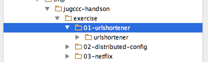

「Import module from external model」で「Maven」を指定してください。

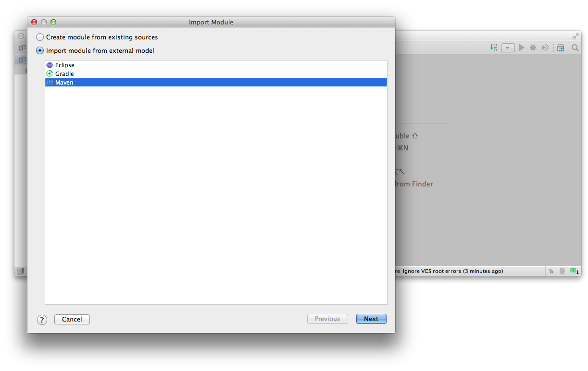

\ **「Search for projects recursively」と「Import Maven projects automatically」にチェックを入れて**\ 、次に進んでください。

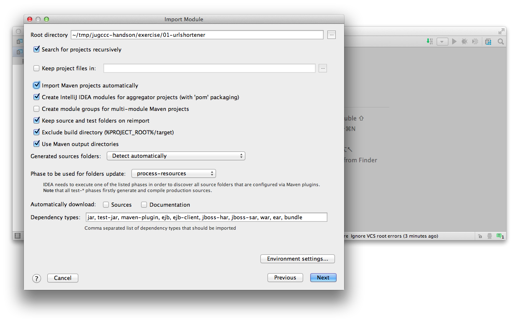

「Next」を繰り返すと、以下のように演習1用のMavenプロジェクトがインポートされます。


.. figure:: ./images/import-exercise01-09.png
   :width: 80%


課題1 TODOを埋めてプログラムを完成させてください
--------------------------------------------------------------------------------

\ ``demo.UrlShortener``\ を編集してください。

以下\ ``TODO``\ 部分を埋めてください。

.. code-block:: java

    @RequestMapping(value = "/", method = RequestMethod.POST)
    ResponseEntity<String> save(@RequestParam String url) {
        if (urlValidator.isValid(url)) {
            String hash = ""/* TODO (1) URLをハッシュ化。ハッシュアルゴリズムには 32-bit murmur3 algorithm を使用する。 */;
            // ヒント: com.google.common.hash.Hashing.murmur3_32()を使う
            // TODO (2) urlMapにhashに紐づくURLを追加する。
            return new ResponseEntity<>(urlShortenUrl + "/" + hash, HttpStatus.OK);
        } else {
            return new ResponseEntity<>(HttpStatus.BAD_REQUEST);
        }
    }

\ ``UrlShortener``\ クラスを右クリックして、\ ``Run UrlShortener.main()``\ をクリックしてください。

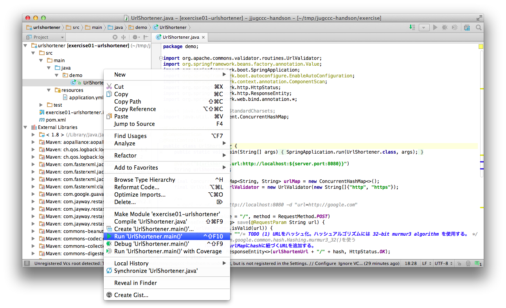


以下のようにも実行できます。

.. code-block:: bash

    $ cd (ハンズオン資材のルートフォルダ)/exercise/01-urlshortener
    $ mvn spring-boot:run -f urlshortener/pom.xml

以下の結果が返るか確認してください。

.. code-block:: bash

    $ curl -X POST http://localhost:8080 -d "url=http://google.com"
    http://localhost:8080/58f3ae21
    $ curl -X GET http://localhost:8080/58f3ae21
    http://google.com


\ ``UrlShortenerTest``\ クラスを右クリックして、\ ``Run UrlShortenerTest``\ をクリックしてください。

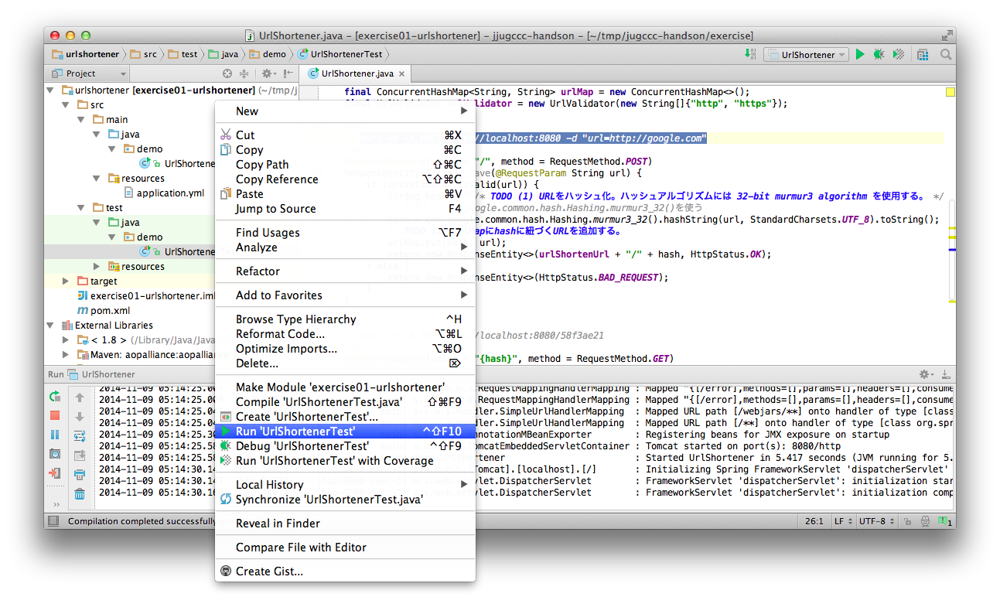

テストが成功したら課題1は完了です。

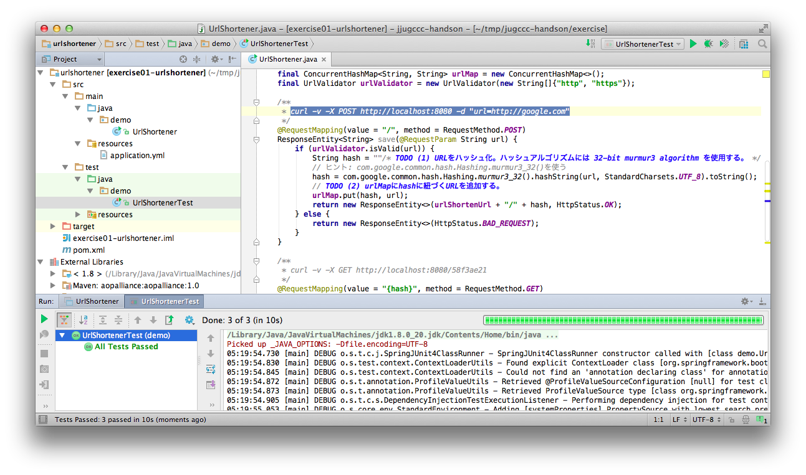

テストは以下のようにも実行できます。

.. code-block:: bash

    $ mvn test -f urlshortener/pom.xml

課題2 Redisを使ってConcurrentHashMap使用部分を書き換えましょう
--------------------------------------------------------------------------------
次に\ ``ConcurrentHashMap``\ の部分をRedisを使用するように書き換えます。
Spring BootによるAutoconfigurationでいかに簡単にRedis (Spring Data Redis)を使用できるか体験します。


Redisの起動
^^^^^^^^^^^^^^^^^^^^^^^^^^^^^^^^^^^^^^^^^^^^^^^^^^^^^^^^^^^^^^^^^^^^^^^^^^^^^^^^

Macの場合

.. code-block:: bash

    $ cd (ハンズオン資材のルートフォルダ)/software/redis-2.8.17
    $ ./src/redis-server
    [34286] 09 Nov 05:27:07.455 # Warning: no config file specified, using the default config. In order to specify a config file use ./src/redis-server /path/to/redis.conf
    [34286] 09 Nov 05:27:07.457 * Increased maximum number of open files to 10032 (it was originally set to 2560).
                    _._
               _.-``__ ''-._
          _.-``    `.  `_.  ''-._           Redis 2.8.17 (00000000/0) 64 bit
      .-`` .-```.  ```\/    _.,_ ''-._
     (    '      ,       .-`  | `,    )     Running in stand alone mode
     |`-._`-...-` __...-.``-._|'` _.-'|     Port: 6379
     |    `-._   `._    /     _.-'    |     PID: 34286
      `-._    `-._  `-./  _.-'    _.-'
     |`-._`-._    `-.__.-'    _.-'_.-'|
     |    `-._`-._        _.-'_.-'    |           http://redis.io
      `-._    `-._`-.__.-'_.-'    _.-'
     |`-._`-._    `-.__.-'    _.-'_.-'|
     |    `-._`-._        _.-'_.-'    |
      `-._    `-._`-.__.-'_.-'    _.-'
          `-._    `-.__.-'    _.-'
              `-._        _.-'
                  `-.__.-'

    [34286] 09 Nov 05:27:07.465 # Server started, Redis version 2.8.17
    [34286] 09 Nov 05:27:07.466 * DB loaded from disk: 0.001 seconds
    [34286] 09 Nov 05:27:07.466 * The server is now ready to accept connections on port 6379

Windowsの場合、redis-server.exeを実行してください。


ソースコードの修正
^^^^^^^^^^^^^^^^^^^^^^^^^^^^^^^^^^^^^^^^^^^^^^^^^^^^^^^^^^^^^^^^^^^^^^^^^^^^^^^^

以下の3カ所を書き換えてください。

.. code-block:: java

    final ConcurrentHashMap<String, String> urlMap = new ConcurrentHashMap<>();
    // ↓
    @Autowired StringRedisTemplate redisTemplate;

に書き換えてください。

.. code-block:: java

    urlMap.putIfAbsent(hash, url);
    // ↓
    redisTemplate.opsForValue().set(hash, url);

に書き換えてください。


.. code-block:: java

    String url = urlMap.get(hash);
    // ↓
    String url = redisTemplate.opsForValue().get(hash);

に書き換えてください。


書き換えた後に、課題1同様にテストが通れば課題2も完了です。

起動したアプリケーションは終了しておいてください。Redisは起動したままにしてください。

演習2 Spring Cloud Configで動的コンフィギュレーション
================================================================================
演習2ではSpring Cloud Configを使った動的コンフィギュレーションを体験します。


演習2で扱うシステムのアーキテクチャ図を以下に示します。

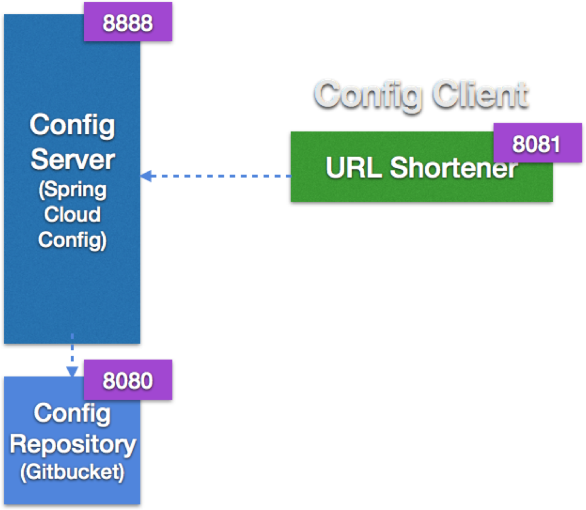

Config Clientとして演習1で作成した「URL短縮サービス」を使用し、Config Server(作成済み)から設定を取得します。

Config ServerはデフォルトでGithubに接続しますが、今回はオフライン環境で実施するため、ローカルに立ち上げたGitbucketを使用します。

演習プロジェクトのインポート
--------------------------------------------------------------------------------
「File」->「Import Module」で演習プロジェクトをインポートします。
「(ハンズオン資材のルートフォルダ)/exercise/02-distributed-config」を選択してください。

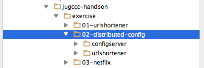

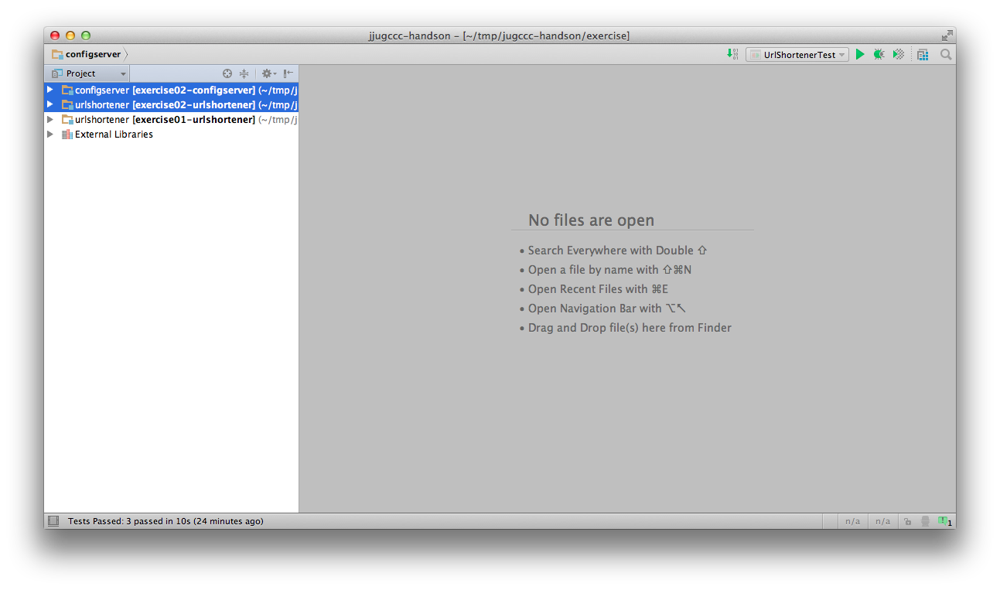

* configserverはConfig Serverを設定したプロジェクトです。
* urlshortenerは演習1にConfig Clientの依存関係を追加したプロジェクトです。

どちらも既に設定済みで、新規にコーディングする必要はありません。

Gitbucketの起動 & Config Repositoryの作成
--------------------------------------------------------------------------------

Gibucketを起動しましょう。8080番ポートを使用するので、このポートを使用しているアプリがあれば終了してください。

.. code-block:: bash

    $ cd (ハンズオン資材のルートフォルダ)/software
    $ java -jar gitbucket.war

http://localhost:8080\ にアクセスしユーザー名/パスワードともに「root」でログインしてください。

.. figure:: ./images/exercise02-02.png
   :width: 80%

右上のメニューから「New repository」をクリックしてください。

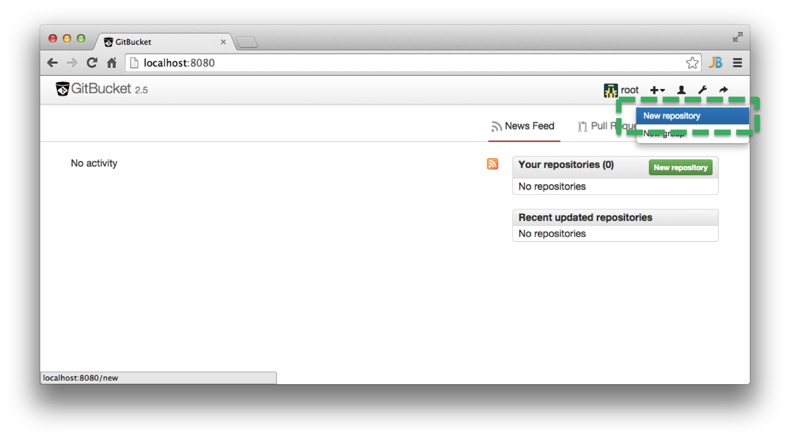

Repository nameに「config-repo」を入力し、「Initialize this repository with a README」にチェックを入れ、「Create repository」をクリックしてください。

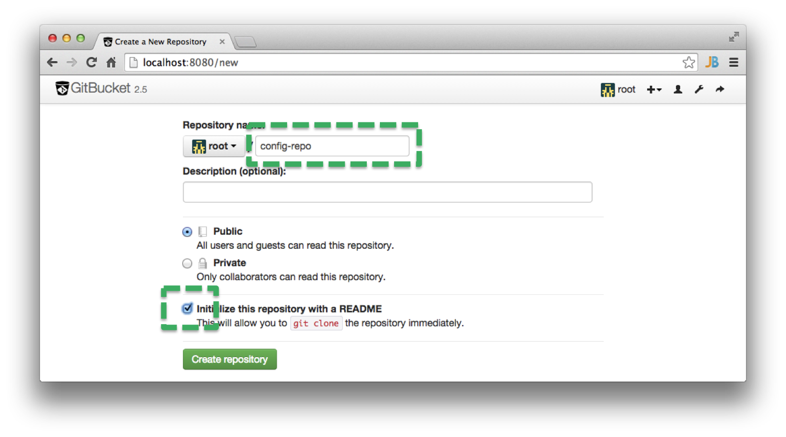

これでConfig Respositoryが作成できました。

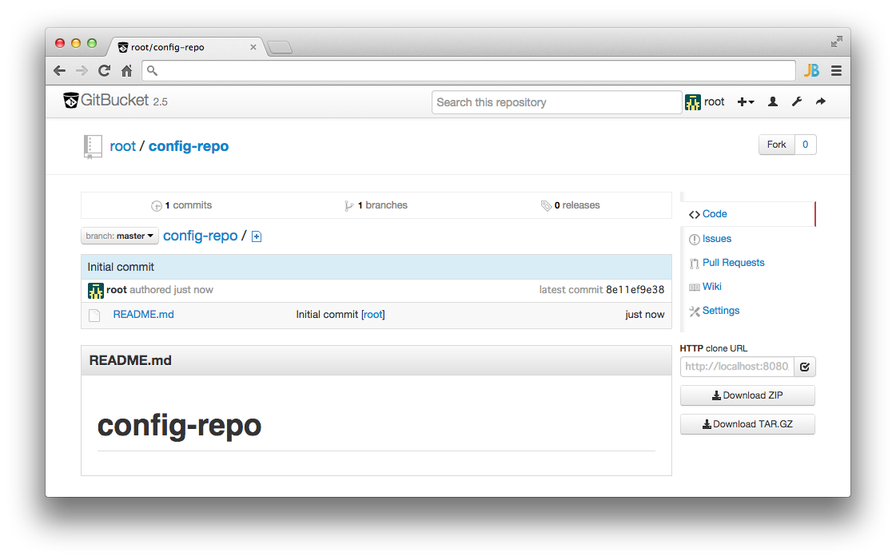

動作確認用のコンフィギュレーションを作成しましょう。レポジトリ名の右に「+」マークをクリックしてください。

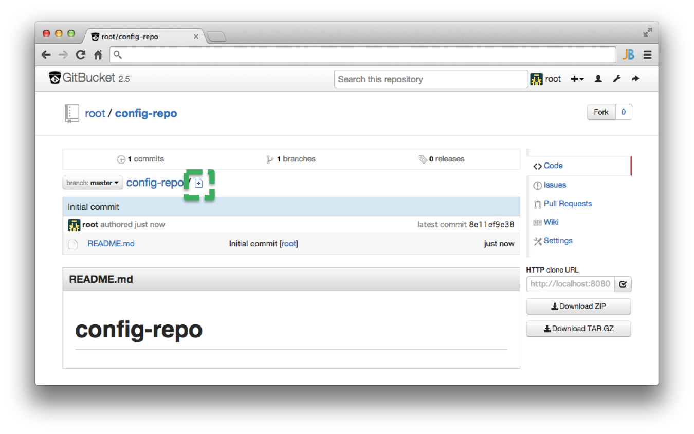


ファイル名を「foo.properties」にし、以下の内容を記入し、「Commit changes」をクリックしてください。

.. code-block:: properties

    foo: 123456
    bar: abcdef

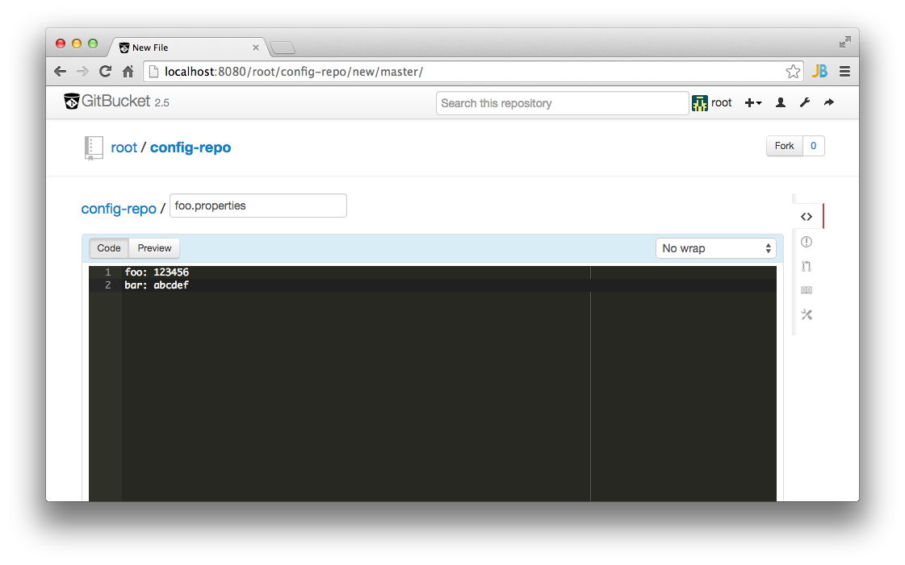

もう一つファイルを作成します。
ファイル名を「foo-development.properties」にし、以下の内容を記入し、「Commit changes」をクリックしてください。

.. code-block:: properties

    foo: Hello!

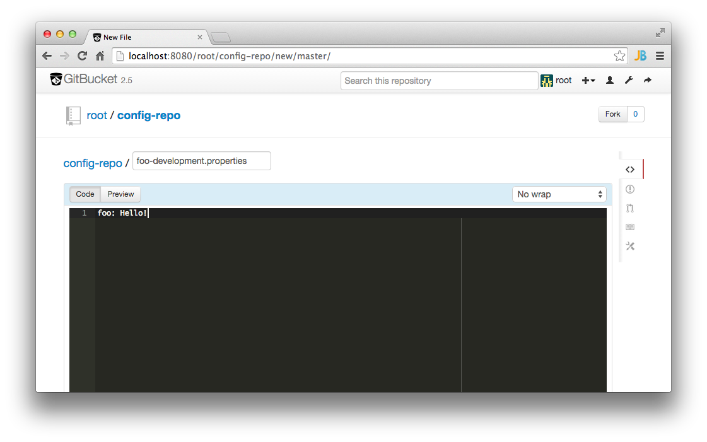

Config Server起動
--------------------------------------------------------------------------------

「configserver」の\ ``bootstrap.yml``\ に以下の設定が行われていることを確認してください。

.. code-block:: yaml

    spring.cloud.config.server.uri: http://localhost:8080/git/root/config-repo.git

以下のコマンドでConfig Serverを起動してください。

.. code-block:: bash

    $ cd (ハンズオン資材のルートフォルダ)/exercise/02-distributed-config
    $ mvn spring-boot:run -f configserver/pom.xml

動作確認しましょう。

.. code-block:: bash

    $ curl http://localhost:8888/admin/env

以下ではjqを使って整形した結果を示します。


.. code-block:: bash

    $ curl http://localhost:8888/admin/env | jq .
    {
      "defaultProperties": {
        "spring.config.name": "configserver"
      },
      "applicationConfig: [classpath:/bootstrap.yml]": {
        "spring.cloud.config.server.uri": "http://localhost:8080/git/root/config-repo.git"
      },
      "applicationConfig: [classpath:/configserver.yml]": {
        "management.context_path": "/admin",
        "spring.application.name": "configserver",
        "server.port": 8888,
        "info.component": "Config Server",
        "spring.jmx.default_domain": "cloud.config.server"
      },
      // ... 省略
    }

\ ``spring.cloud.config.server.uri``\ が反映されていることを確認してください。

次にコンフィギュレーションを取得します。app名はfoo、profile名はdefaultにします。

.. code-block:: bash

    $ curl http://localhost:8888/foo/default

以下ではjqを使って整形した結果を示します。

.. code-block:: bash

    $ curl http://localhost:8888/foo/default | jq .
    {
      "propertySources": [
        {
          "source": {
            "foo": "123456",
            "bar": "abcdef"
          },
          "name": "http://localhost:8080/git/root/config-repo.git/foo.properties"
        }
      ],
      "label": "master",
      "name": "default"
    }

次にprofileを変更して取得しましょう。

.. code-block:: bash

    $ curl http://localhost:8888/foo/development


以下ではjqを使って整形した結果を示します。

.. code-block:: bash

    $ curl http://localhost:8888/foo/development | jq .
    {
      "propertySources": [
        {
          "source": {
            "foo": "Hello!"
          },
          "name": "http://localhost:8080/git/root/config-repo.git/foo-development.properties"
        },
        {
          "source": {
            "foo": "123456",
            "bar": "abcdef"
          },
          "name": "http://localhost:8080/git/root/config-repo.git/foo.properties"
        }
      ],
      "label": "master",
      "name": "development"
    }

\ ``foo-development.properties``\ で上書きしていることが分かります。


「URL短縮サービス」向けのコンフィギュレーション作成
--------------------------------------------------------------------------------

同様に、URL短縮サービス向けのコンフィギュレーションを「urlshortener.yml」に作成します。設定内容は以下の通りです。

.. code-block:: yaml

    urlshorten:
      url: http://localhost:${server.port}
    spring:
      redis:
        host: localhost # server host
        password: # server password
        port: 6379 # connection port
        pool:
          max-idle: 8 # pool settings ...
          min-idle: 0
          max-active: 8
          max-wait: -1
    endpoints.restart:
      enabled: true

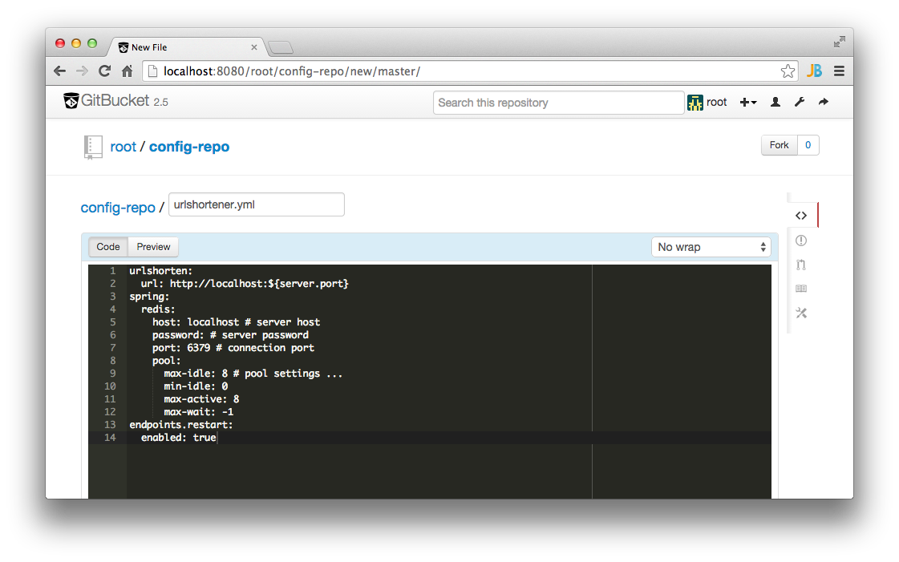


動作確認しましょう。(Config Serverの再起動は不要です)

.. code-block:: bash

    $ curl http://localhost:8888/urlshortener/default


以下ではjqを使って整形した結果を示します。

.. code-block:: bash

    $ curl http://localhost:8888/urlshortener/default | jq .
    {
      "propertySources": [
        {
          "source": {
            "spring.redis.pool.max-idle": 8,
            "spring.redis.password": "",
            "spring.redis.host": "localhost",
            "spring.redis.port": 6379,
            "urlshorten.url": "http://localhost:${server.port}",
            "endpoints.restart.enabled": true,
            "spring.redis.pool.max-active": 8,
            "spring.redis.pool.min-idle": 0,
            "spring.redis.pool.max-wait": -1
          },
          "name": "http://localhost:8080/git/root/config-repo.git/urlshortener.yml"
        }
      ],
      "label": "master",
      "name": "default"
    }

Git上の変更が即反映されています。


「URL短縮サービス」(Config Client)の起動
--------------------------------------------------------------------------------

次にConfig Clientとして、「URL短縮サービス」を起動します。

インポートしたプロジェクト(exercise/02-distributed-config/urlshortener)のpom.xmlに以下の依存関係が追加されていることを確認してください。

.. code-block:: xml

        <dependency>
            <groupId>org.springframework.cloud</groupId>
            <artifactId>spring-cloud-starter</artifactId>
        </dependency>
        <dependency>
            <groupId>org.springframework.boot</groupId>
            <artifactId>spring-boot-starter-actuator</artifactId>
        </dependency>

また、urlshortenerのbootstrap.ymlに

.. code-block:: yaml

    spring:
      application:
        name: urlshortener

が設定されていることを確認してください。

「URL短縮サービス」を起動しましょう。8080番ポートは既に起動しているので、プログラム引数に\ ``--server.port=8081``\ をつけて8081番ポートで起動します。

.. code-block:: bash

    $ cd (ハンズオン資材のルートフォルダ)/exercise/02-distributed-config
    $ mvn spring-boot:run -f urlshortener/pom.xml -Drun.arguments="--server.port=8081"


演習1同様に以下のリクエストを送ってください。(ポート名が変更されていることに気をつけてください)

.. code-block:: bash

    $ curl -X POST http://localhost:8081 -d "url=http://google.com"
    http://localhost:8081/58f3ae21
    $ curl -X GET http://localhost:8081/58f3ae21
    http://google.com

次にConfig Server(urlshortener.yml)の値を変えましょう。

http://localhost:8080/root/config-repo/blob/master/urlshortener.yml\ にアクセスし、「Edit」ボタンをクリックしてください。

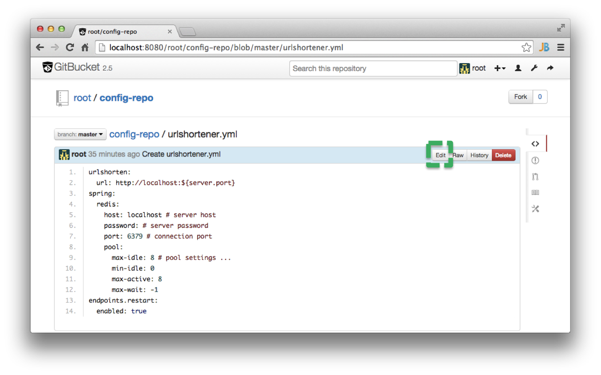

\ ``urlshorten.url``\ を\ ``http://localhost:9999``\ に変更して「Commit changes」をクリックしてください。(\ **この設定は演習3で使用します**\ )。

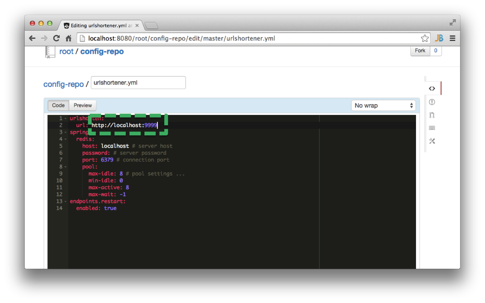

変更を反映する前に、Config Client上のプロパティを確認しましょう。

.. code-block:: bash

    $ curl -X GET http://localhost:8081/env/urlshorten.url
    http://localhost:8081


次にConfig Clientをrefreshします。

.. code-block:: bash

    $ curl -X POST http://localhost:8081/refresh
    ["urlshorten.url"]
    $ curl -X GET http://localhost:8081/env/urlshorten.url
    http://localhost:9999

変更が反映されました。しかし、以下の通りDI済みのプロパティに再DIはされていません。

.. code-block:: bash

    $ curl -X POST http://localhost:8081 -d "url=http://google.com"
    http://localhost:8081/58f3ae21

今度はConfig Clientをrestartします。

.. code-block:: bash

    $ curl -X POST http://localhost:8081/restart
    {"message":"Restarting"}

restart後は、最新のプロパティで再DIされていることがわかります。

.. code-block:: bash

    $ curl -X POST http://localhost:8081 -d "url=http://google.com"
    http://localhost:9999/58f3ae21


課題3 「URL短縮サービス」(Config Client)をRefreshスコープに変更
--------------------------------------------------------------------------------
「URL短縮サービス(\ ``UrlShortener``\ クラス)」へのプロパティインジェクション反映をrefreshで行えるように、
\ ``UrlShortener``\ クラスをRefreshスコープに変更してください。

.. code-block:: java

    @EnableAutoConfiguration
    @ComponentScan
    @RestController
    @RefreshScope // ここを追加
    public class UrlShortener {
        // 略
    }

\ ``mvn spring-boot:run``\ で起動した「URL短縮サービス」をCtrl+Cで終了して、再度実行してください。


.. code-block:: bash

    $ mvn spring-boot:run -f urlshortener/pom.xml -Drun.arguments="--server.port=8081"

今回は以下のようにEnvエンドポイントにPOSTすることでコンフィギュレーションを変更しましょう。


.. code-block:: bash

    $ curl -X POST http://localhost:8081/env -d urlshorten.url=http://127.0.0.1:9999
    {"urlshorten.url":"http://127.0.0.1:9999"}

再度、refreshを行い、もう一度「URL短縮サービス」へリクエストを送りましょう。

.. code-block:: bash

    $ curl -X POST http://localhost:8081/refresh
    []
    $ curl -X POST http://localhost:8081 -d "url=http://google.com"
    http://127.0.0.1:9999/58f3ae21

restartすることなく、アプリケーションにプロパティが反映されたことがわかります。

Config Server、Config ClientともにCtrl+Cで終了してください。(Gitbucket, Redisは起動したままにしてください。）

演習3 Spring Cloud Netflixでマイクロサービスアーキテクチャ構築
================================================================================
演習3ではSpring Cloud Netflixを使った様々なパターンを体験します。


演習3で扱うシステムのアーキテクチャ図を以下に示します。

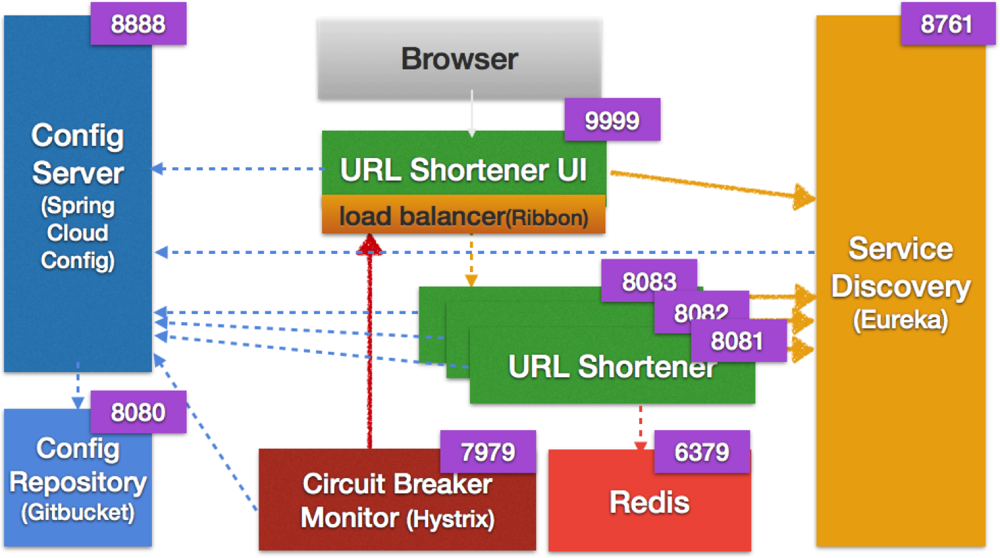

演習プロジェクトのインポート
--------------------------------------------------------------------------------
「File」->「Import Module」で演習プロジェクトをインポートします。
「(ハンズオン資材のルートフォルダ)/exercise/03-netflix」を選択してください。

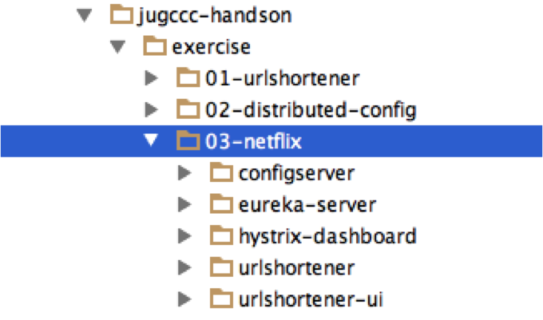

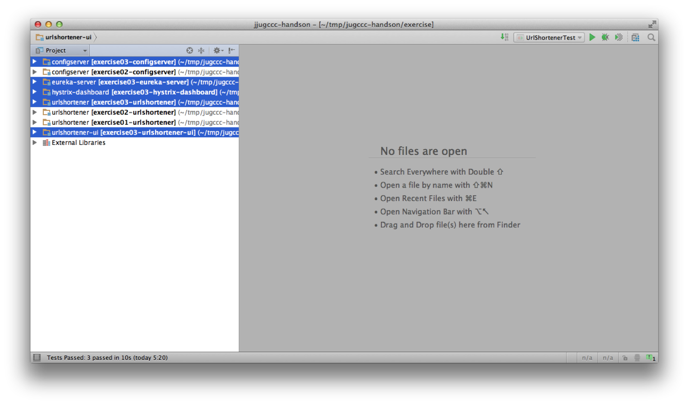

* configserverはConfig Serverを設定したプロジェクトです。演習2と同じです。
* eureka-serverはService DiscoveryであるEurekaを起動するプロジェクトです。ダッシュボードも提供します。
* hystrix-dashboardはHystrixのダッシュボードを提供するプロジェクトです。
* urlshortenerは演習2にConfig Clientの依存関係を追加したプロジェクトです。
* urlshortener-uiは「URL短縮サービス」の画面です。\ ``RestClient``\ とClient LoadbalancerのRibboを使ってurlshortenerにアクセスします。

どれも既に設定済みで、新規にコーディングする必要はありません。上から順番に起動します。

演習2で起動したGitbucketが必要ですので、終了してしまった場合は再び実行してください。


Config Serverの起動
--------------------------------------------------------------------------------

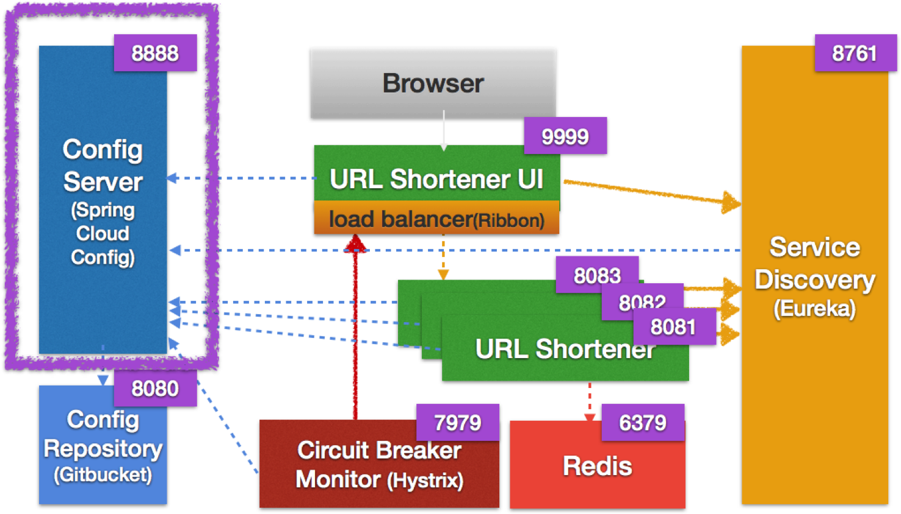

演習2同様に、以下のコマンドでConfig Serverを起動してください。

.. code-block:: bash

    $ cd (ハンズオン資材のルートフォルダ)/exercise/03-netflix
    $ mvn spring-boot:run -f configserver/pom.xml


Service Discovery (Eureka Server)の起動
--------------------------------------------------------------------------------

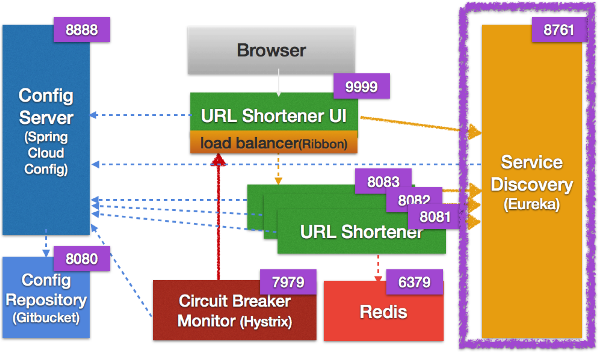

以下のコマンドでEureka Serverを起動してください。

.. code-block:: bash

    $ cd (ハンズオン資材のルートフォルダ)/exercise/03-netflix
    $ mvn spring-boot:run -f eureka-server/pom.xml

http://localhost:8761/\ でEureka Serverのダッシュボードにアクセスできます。


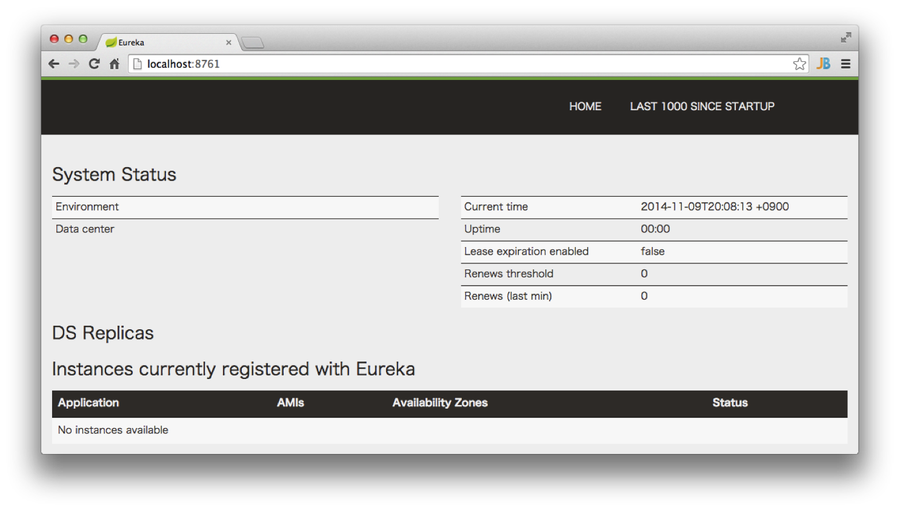

現時点ではEureka Serverに登録されているインスタンスはありません。

Circuit Breaker Monitor (Hystrix Dashboard)の起動
--------------------------------------------------------------------------------

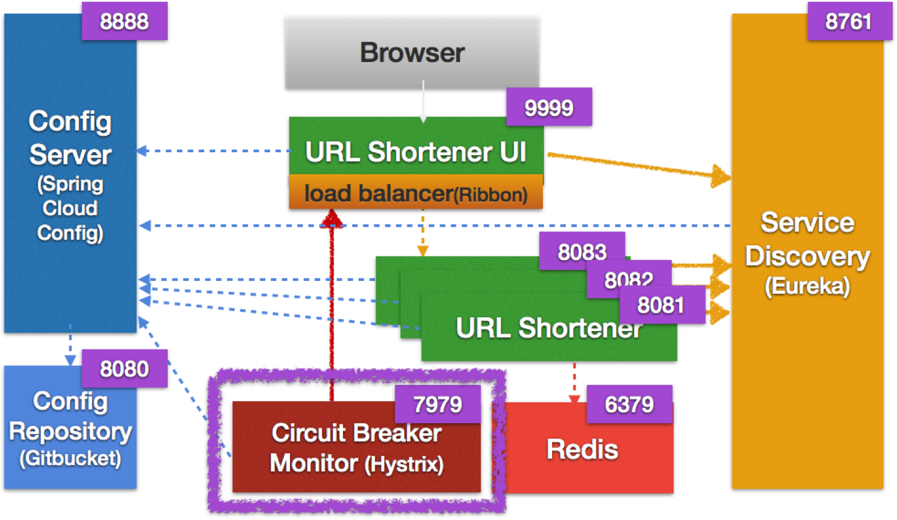

以下のコマンドでHystrix Dashboardを起動してください。

.. code-block:: bash

    $ cd (ハンズオン資材のルートフォルダ)/exercise/03-netflix
    $ mvn spring-boot:run -f hystrix-dashboard/pom.xml

起動後、30秒経ったら\ `Eureka Serverのダッシュボード <http://localhost:8761>`_\ にアクセスしてください。

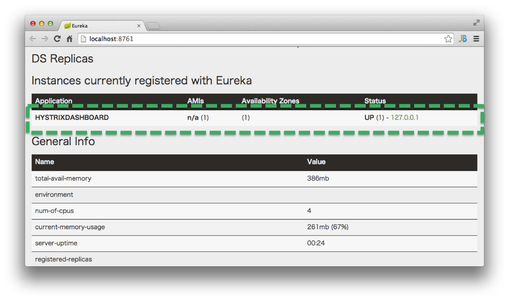

Hystrix DashboardがEurekaに登録されたことが分かります(アーキテクチャ図に記されていませんが、Circuit Breaker MonitorからService Discoveryへの線相当です)。

ではHystrix Dashboardにアクセスしましょう。http://localhost:7979\ にアクセスしてください。

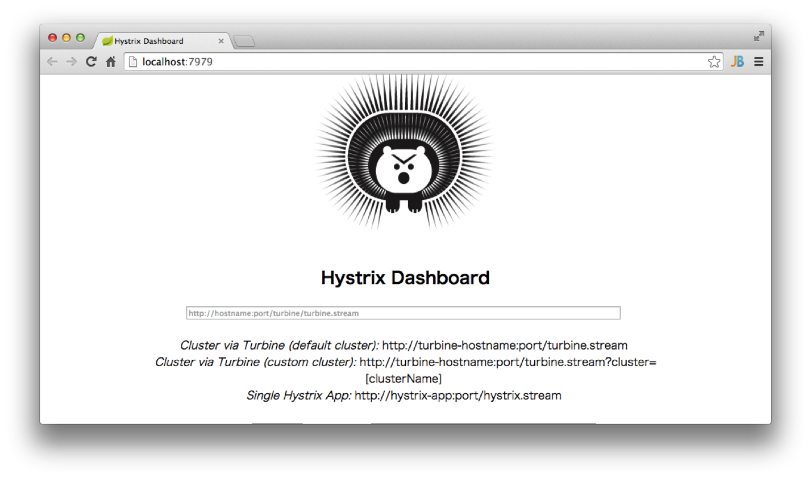

中央の入力フォームにはHystrixを利用したサービスの情報を取得するためのevent streamのURLを指定することで、
そのサービスをモニタリングすることができます。

まだHystrixを利用したサービスがないため、ここではデモ用のMock Streamを使用します。http://localhost:7979/mock.stream\ を入力して、「Monitor Stream」をクリックしてください。


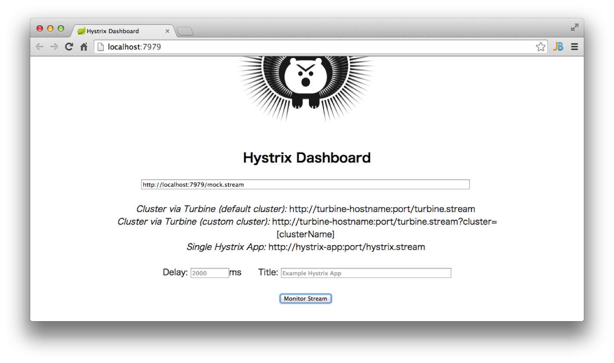

Hystrixのイベントをモニタリングできます。

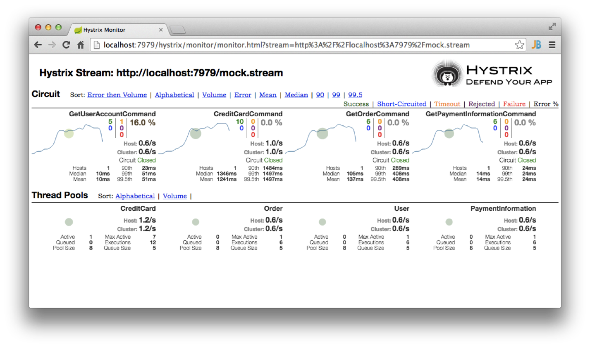

後ほど「URL短縮サービス」のevent streamをモニタリングします。


「URL短縮サービス」の起動
--------------------------------------------------------------------------------


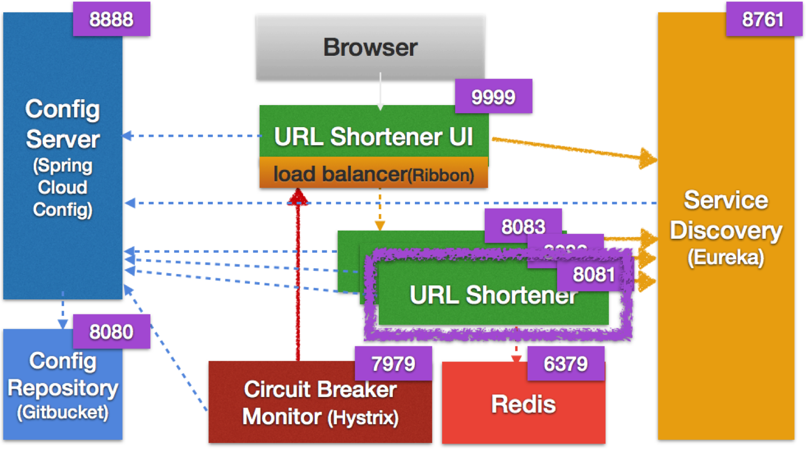

次に演習1から使い続けている「URL短縮サービス」を起動します。

後ほどこの「URL短縮サービス」を3台起動します。Eurekaに別hostnameとして認識させるため、あらかじめ/etc/hostsに以下の設定を追加しておきます。

.. code-block:: bash

    127.0.0.1	urlshortener1 urlshortener2 urlshortener3

尚、演習2のurlshortenに対して、以下の変更を加えています。

\ ``UrlShortener``\ クラスがEurekaのクライアントになるために\ ``@EnableEurekaClient``\ を追加しています。

.. code-block:: java

    @EnableAutoConfiguration
    @ComponentScan
    @RestController
    @RefreshScope
    @EnableEurekaClient // 追加
    public class UrlShortener {
        // 略
    }

application.ymlにEurekaに関する情報を追加しています。

.. code-block:: yaml

    eureka:
      client:
        serviceUrl:
          defaultZone: http://localhost:8761/eureka/
      instance:
        hostname: ${APPLICATION_DOMAIN:127.0.0.1}
        nonSecurePort: ${server.port}


それでは「URL短縮サービス」を起動しましょう。portとEurekaに登録するhostnameを指定します。

.. code-block:: bash

    $ cd (ハンズオン資材のルートフォルダ)/exercise/03-netflix
    $ mvn spring-boot:run -f urlshortener/pom.xml \
     -Drun.arguments="--server.port=8081,--eureka.instance.hostname=urlshortener1"

起動後、30秒経ったら\ `Eureka Serverのダッシュボード <http://localhost:8761>`_\ にアクセスしてください。

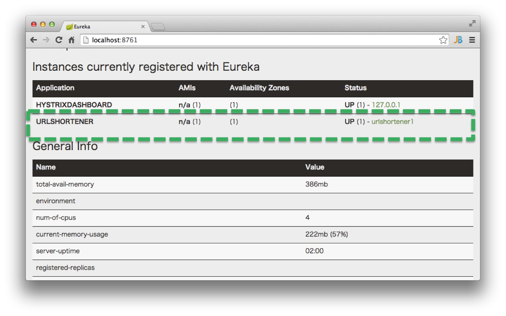

urlshortenerがEurekaに登録されたことが分かります。


「URL短縮サービス」UIの起動
--------------------------------------------------------------------------------
最後のサービスとして「URL短縮サービス」UIを起動します。

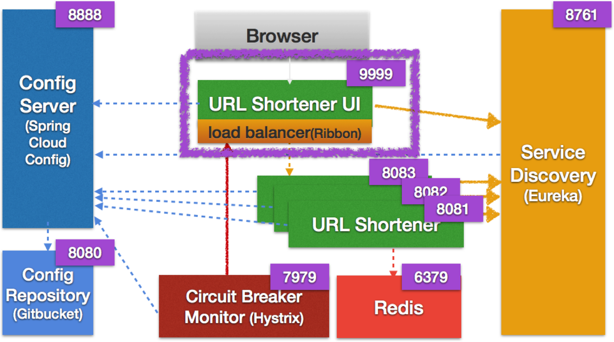

起動する前にUI用のコンフィギュレーションを作成します。

\ `Config Repository <http://localhost:8080/root/config-repo>`_\ にアクセスして、urlshortener-ui.ymlを作成し、以下の内容を記述してください。


.. code-block:: yaml

    urlshorten.api.url: http://urlshortener
    endpoints.restart:
      enabled: true


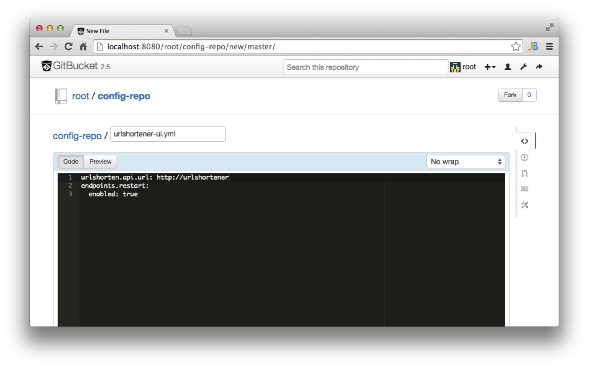


UIを9999番ポートで起動します。

.. code-block:: bash

    $ mvn spring-boot:run -f urlshortener-ui/pom.xml -Drun.arguments="--server.port=9999"


起動後、30秒経ったら\ `Eureka Serverのダッシュボード <http://localhost:8761>`_\ にアクセスしてください。

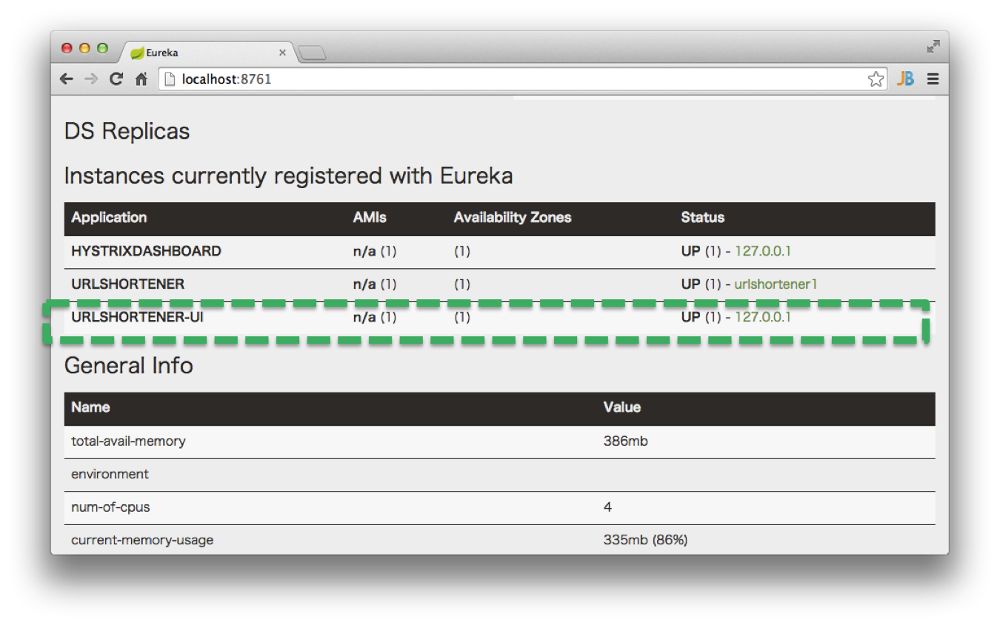

urlshortener-uiがEurekaに登録されたことが分かります。

それでは\ http://localhost:9999\ にアクセスしましょう。

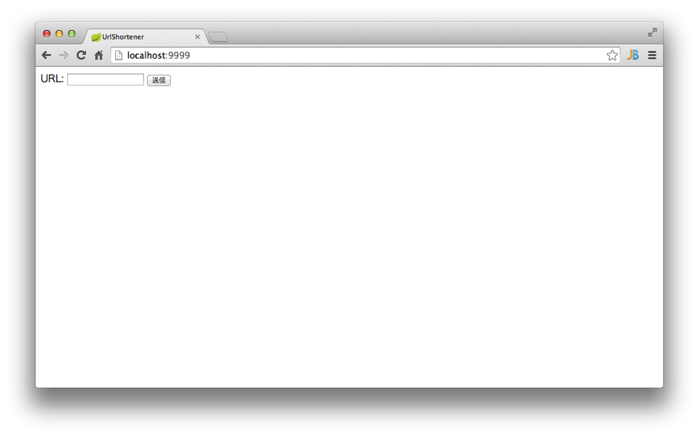

url入力フォームに「http://google.com」を入力して、送信ボタンをクリックしましょう。

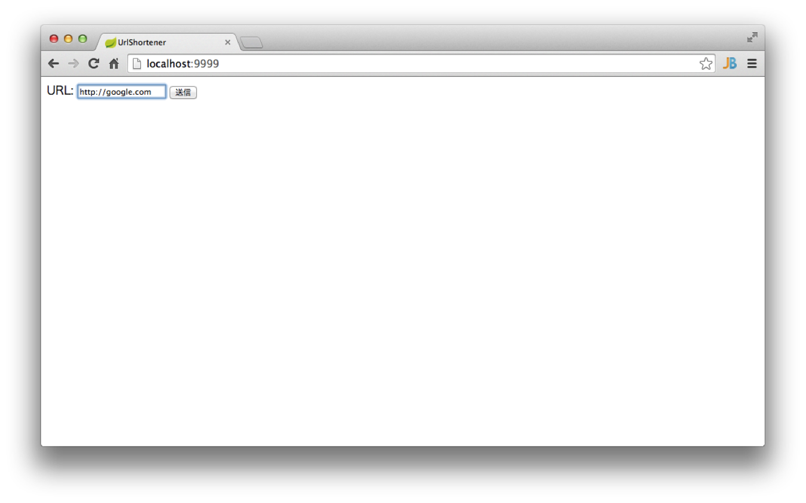

バックエンドの「URL短縮サービス」が呼ばれて短縮URLが表示されます。

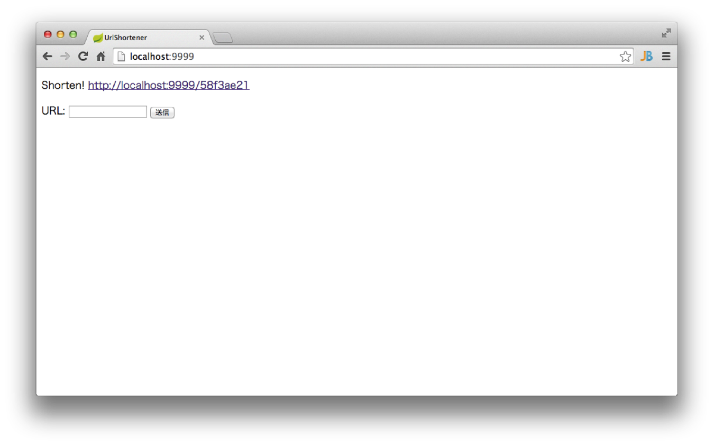

表示されたURLをクリックすると\ http://google.com\ へリダイレクトされます。

urlshorten-uiではHystrix + Ribbonを使用して、urlshortenのサービスをcallしています。

Hystrixのevent streamは\ http://localhost:9999/hystrix.stream\ でアクセスできます。


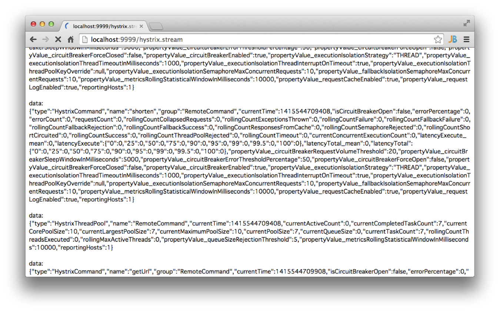

\ `Hystrix Dashboard <http://localhost:7979>`_\ に\ http://localhost:9999/hystrix.stream\ を入力してモニタリングしてみましょう。


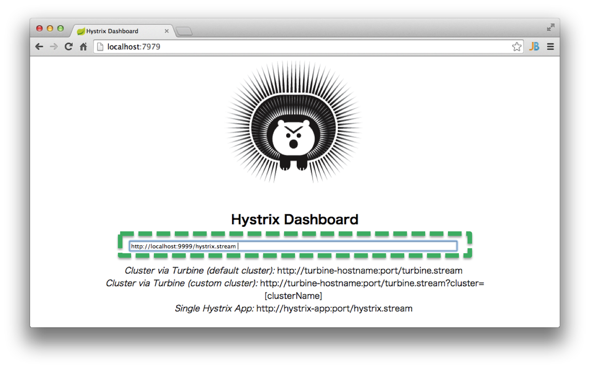

UIからサービスを呼び出すとモニタリング画面に反映されます。

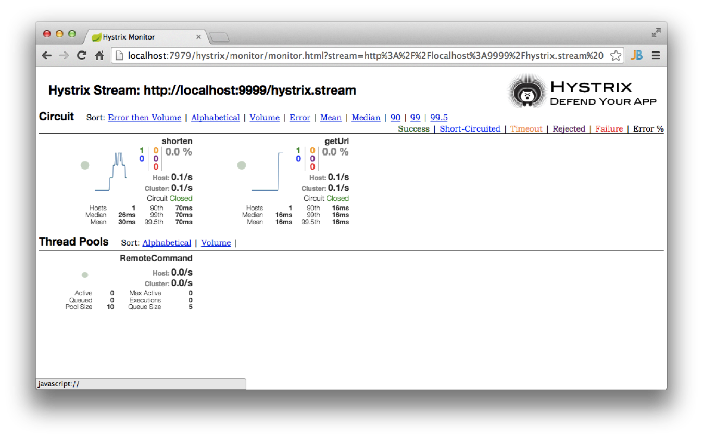

「URL短縮サービス」のスケールアウト
--------------------------------------------------------------------------------

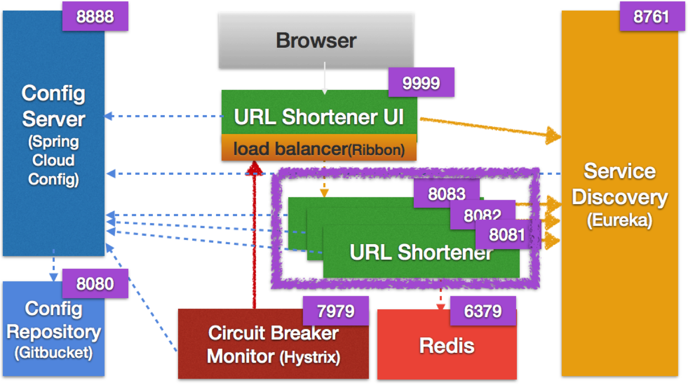

最後に「URL短縮サービス」をあと2インスタンス起動し、Ribbonによるロードバランシングを体験しましょう。

早速、「URL短縮サービス」を起動しましょう。

インスタンス2はport: 8082,hostname: urlshortener2で起動します。

.. code-block:: bash

    $ cd (ハンズオン資材のルートフォルダ)/exercise/03-netflix
    $ mvn spring-boot:run -f urlshortener/pom.xml \
     -Drun.arguments="--server.port=8082,--eureka.instance.hostname=urlshortener2"

インスタンス3はport: 8083,hostname: urlshortener3で起動します。

.. code-block:: bash

    $ cd (ハンズオン資材のルートフォルダ)/exercise/03-netflix
    $ mvn spring-boot:run -f urlshortener/pom.xml \
     -Drun.arguments="--server.port=8083,--eureka.instance.hostname=urlshortener3"


ノード2、ノード3起動後30秒経ったら、\ `Eureka Serverのダッシュボード <http://localhost:8761>`_\ にアクセスしてください。

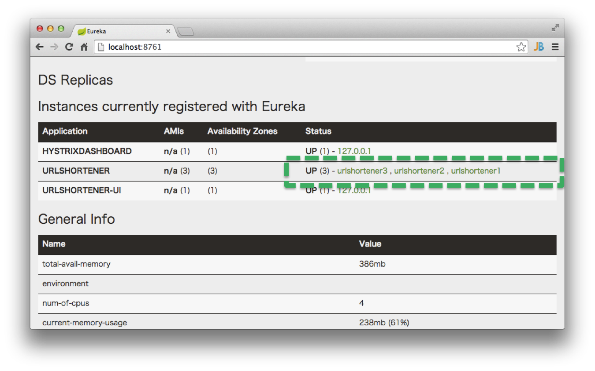

urlshortenerサービスに対して3つのインスタンスが登録されました。


UIではRibbonを利用することで、特定のインスタンスにアクセスしているわけではなく、\ ``http://urlshortener``\ というようにサービス名に対してアクセスしており、
ラウンドロビンのロードバランシングが行われます。

いまの作りだと、どのインスタンスでURL短縮が行われているか分からないので、以下のような設定変更を行いましょう。

.. code-block:: bash

    curl -X POST http://localhost:8081/env -d "urlshorten.url=http://localhost:\${server.port}"
    curl -X POST http://localhost:8081/refresh
    curl -X POST http://localhost:8082/env -d "urlshorten.url=http://localhost:\${server.port}"
    curl -X POST http://localhost:8082/refresh
    curl -X POST http://localhost:8083/env -d "urlshorten.url=http://localhost:\${server.port}"
    curl -X POST http://localhost:8083/refresh

これでUIから何度もリクエストを送ると、各インスタンスが順番に使用されていることが分かります。


どれかのインスタンスを落としたり、復旧させたりして何が起こるか試してみてください。

.. note::

    単位時間辺りのエラー発生回数がしきい値を超えるとCiruitがOpen状態になり、一定時間ずっとエラーを返すようになります。


まとめ
================================================================================

本演習を通じて以下の内容を学びました。

* 演習1ではSpring Bootを使って簡単にマイクロサービスを作成する方法を学びました。また数行でRedisに対応する方法も学びました。
* 演習2ではSpring Cloud Configを使って動的コンフィギュレーションの行い方を学びました。
* 演習3ではSpring Cloud Netflixを使ってマイクロサービスアーキテクチャにおけるいくつかのパターンを実現しました。

さらなる学習には\ `Spring CloudのReference <http://projects.spring.io/spring-cloud/spring-cloud.html>`_\ を参照してください。
